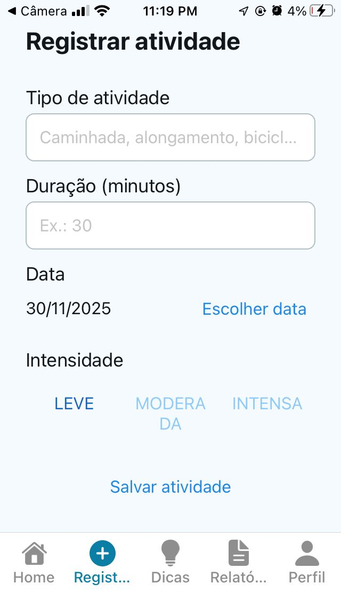
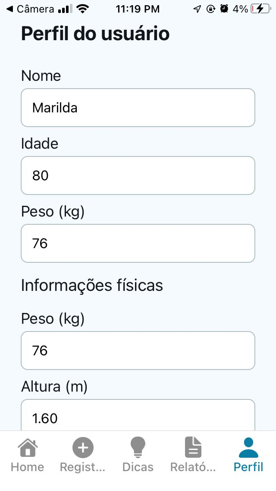

## Bem Viver - Monitor de Atividades Físicas para Idosos

Aplicativo mobile em **React Native + Expo** para monitorar atividades físicas de pessoas idosas, alinhado à **ODS 3 - Saúde e Bem‑Estar**.  
Focado em simplicidade, acessibilidade (fontes grandes, botões amplos, alto contraste) e registro local de dados.

### 📱 Funcionalidades do MVP

- **Cadastro do usuário**: nome, idade, peso, altura e observações de saúde.
- **Registro diário de atividades**: tipo, duração em minutos, data, intensidade (leve, moderada, intensa) com persistência em **SQLite**.
- **Resumo de bem-estar (Home)**: total de minutos ativos na semana, quantidade de dias praticados e mensagens motivacionais.
- **Aba de dicas**: cards estáticos com boas práticas (exercícios leves, hidratação, caminhada, alongamentos).
- **Relatórios**:
  - Exportar atividades para **Excel (.xlsx)**.
  - Gerar relatório em **PDF** com:
    - Cabeçalho com nome do app;
    - Dados do usuário;
    - Período analisado;
    - Tabela de atividades;
    - Rodapé com referência à **ODS 3**.
- **Navegação por abas**: Home, Registrar Atividade, Dicas, Relatórios, Perfil.

### 🧱 Stack

- **React Native + Expo**
- **Expo Router + React Navigation (Tabs)**
- **SQLite local** (`expo-sqlite`)
- **Exportação de arquivos**:
  - Excel: `xlsx` + `expo-file-system` + `expo-sharing`
  - PDF: `expo-print` + `expo-sharing`

### 📂 Estrutura de pastas (principal)

- `app/`
  - `_layout.tsx` – stack/navegação raiz
  - `(tabs)/_layout.tsx` – navegação por abas
  - `(tabs)/index.tsx` – Home com resumo de bem‑estar
  - `(tabs)/registrar-atividade.tsx` – registro de atividades
  - `(tabs)/dicas.tsx` – cards estáticos de boas práticas
  - `(tabs)/relatorios.tsx` – filtros + exportação Excel/PDF
  - `(tabs)/perfil.tsx` – dados do usuário
- `lib/`
  - `db.ts` – configuração do SQLite e helpers (`users`, `activities`)
  - `exportExcel.ts` – exportação de atividades para `.xlsx`
  - `exportPdf.ts` – geração de relatório em PDF
- `components/` – componentes de UI (texto temático, layout, etc.)

### 🗄️ Banco de dados (SQLite)

**Schema:**

- `users`  
  - `id` (INTEGER, PK, AUTOINCREMENT)  
  - `name` (TEXT, NOT NULL)  
  - `age` (INTEGER, NOT NULL)  
  - `weight` (REAL, NOT NULL)  
  - `height` (REAL, NOT NULL)  
  - `health_notes` (TEXT)

- `activities`  
  - `id` (INTEGER, PK, AUTOINCREMENT)  
  - `user_id` (INTEGER, FK → users.id)  
  - `type` (TEXT, NOT NULL)  
  - `duration_minutes` (INTEGER, NOT NULL)  
  - `intensity` (TEXT, NOT NULL) — `leve`, `moderada`, `intensa`  
  - `activity_date` (TEXT, NOT NULL, formato `YYYY-MM-DD`)

Criação das tabelas e helpers estão em `lib/db.ts`:

- **`getDb()`**: abre/cria o banco `bem_viver.db` e aplica o schema.
- **`getSingleUser()`**: retorna o único usuário cadastrado (MVP).
- **`upsertSingleUser()`**: insere/atualiza o usuário.
- **`addActivity()`**: insere uma nova atividade associada ao usuário.
- **`listActivitiesBetween()`**: lista atividades em um intervalo de datas.
- **`getWeeklySummary()`**: resumo semanal (minutos totais, dias com atividade).

### 📊 Exportação Excel

A função `exportActivitiesToExcel(activities)` em `lib/exportExcel.ts`:

- Recebe uma lista de atividades já filtradas.
- Constrói um workbook com a aba **Atividades**.
- Gera um `.xlsx` em base64 e salva no cache com `expo-file-system`.
- Abre o diálogo de compartilhamento com `expo-sharing`.

Uso (exemplo simplificado dentro de uma tela):

```ts
import { exportActivitiesToExcel } from '@/lib/exportExcel';

await exportActivitiesToExcel(activities);
```

### 🧾 Geração de PDF

A função `exportActivitiesToPdf({ user, activities, periodStart, periodEnd })` em `lib/exportPdf.ts`:

- Monta um HTML com:
  - Cabeçalho “Bem Viver - Relatório de Atividades Físicas”;
  - Dados do usuário;
  - Período analisado;
  - Tabela de atividades (ou mensagem de ausência de dados);
  - Rodapé com referência à **ODS 3 - Saúde e Bem‑Estar**.
- Usa `expo-print` para gerar o PDF.
- Usa `expo-sharing` para compartilhar o arquivo.

### 🚀 Como rodar o projeto

1. **Instalar dependências**

   ```bash
   npm install
   ```

2. **Instalar pacotes nativos adicionais (se ainda não instalados):**

   Recomenda-se usar o próprio Expo para garantir versões compatíveis com o SDK:

   ```bash
   npx expo install expo-sqlite expo-file-system expo-sharing expo-print @react-native-community/datetimepicker
   npm install xlsx
   ```

3. **Rodar o app**

   ```bash
   npx expo start
   ```

4. **Abrir no dispositivo/emulador**

- Expo Go (Android/iOS) ou emuladores/simuladores configurados.

### 🧭 Navegação e telas

- **Home (`index.tsx`)**: resumo semanal (minutos ativos, dias com atividade) e mensagem motivacional simples, com cards em fundo branco e visual de saúde.
- **Registrar Atividade (`registrar-atividade.tsx`)**: formulário para tipo, duração, data (DateTimePicker), intensidade; salva em SQLite.
- **Dicas (`dicas.tsx`)**: cards estáticos com textos educativos e layout com fundo azul-claro e cartões brancos.
- **Relatórios (`relatorios.tsx`)**: seleção de período, lista das atividades do SQLite e botões para **Exportar Excel** e **Gerar PDF**.
- **Perfil (`perfil.tsx`)**: formulário para dados do usuário (altura exibida em metros, mas armazenada em cm) com persistência em SQLite e card mostrando os dados salvos.

### ♿ Acessibilidade

- Fontes maiores (18+ em textos, 22+ em títulos).
- Botões amplos com cores de alto contraste.
- Navegação por abas fixa na parte inferior com ícones e rótulos claros.

### 🌍 Alinhamento à ODS 3 (Saúde e Bem‑Estar)

- Incentiva **atividade física regular e segura** para pessoas idosas.
- Promove **autocuidado**, registro de hábitos e visão clara de progresso.
- Facilita o compartilhamento de relatórios com profissionais de saúde ou familiares.

### 🖼️ Capturas de tela do app

Sugestão: salve suas imagens em uma pasta como `assets/screenshots/` e ajuste os caminhos abaixo.
Aqui estão **7 slots** organizados em grade para você trocar pelos seus arquivos reais:

| Home | Registrar Atividade | Dicas |
| --- | --- | --- |
|  |  |  | 

| Relatórios | Perfil | Splash / Abertura |
| --- | --- | --- |
|  |  |  |
